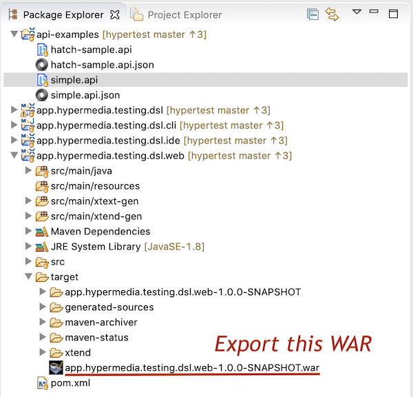

> # Hypertest DSL
> Domain-Specific Language for testing APIs, hypermedia-style

_:exclamation: Early version; work in progress :construction: at [Zazuko][zazuko]._

[][zazuko]

[zazuko]: https://zazuko.com

## Introduction

Hypertest DSL is a tool which lets API authors build end-to-end testing suites as a series of client-server interactions which resemble the implementation of a hypermedia-driven applications.

In other words, the tests are solely executing based on links and forms, all of which should be provided by the server in resoruce representations.

The DSL itself is agnosrtic of the media type. A test runner could be implemented to run against any RESTful API such as [SIREN][SIREN], [Hydra][Hydra], [NARWHL][Narwhal], [HAL-FORMS][hal], etc.

[SIREN]: https://github.com/kevinswiber/siren
[Hydra]: http://www.hydra-cg.com/spec/latest/core/
[Narwhal]: https://www.narwhl.com
[hal]: https://rwcbook.github.io/hal-forms/

## Quick start

Tests are written down as `.api` files. Here's an all too-simple test document:

```
# tests/scenario.api

With Class "Person" {
  Expect Property "name"
} 
```

It will instruct the runner to check that any ocurrence of the `Person` class has a `name` property.

More examples are available on [testing.hypermedia.app](https://testing.hypermedia.app).

### Install compiler

Runners will work with a JSON representation of the test documents. A compiler can be used to transform the `.api` files to JSON:
 
```
npm i -g @hydrofoil/hypertest
```

Run it by passing a directory. You may try it on the samples directory in this repository:

```
hypertest-compiler ./api-example
```

It will produce a `.api.json` for each test scenario document.

## Developing and running locally

### Setting up development environment

The DSL and compiler are implemented in Java using [Xtext][xtext]. 

* `npm install` to set up git hooks
* Install a Java JDK (Java 8)
* Install [Eclipse IDE for Java and DSL Developers][ide]. Version 2019.03. Newer may not work.
* (In Eclipse) Add git repo:
  * Show the "Git Repositories" view: *Window | Show View | Other... | Git | Git Repositories*
  * Add git repo: *Add an (existing) Repository* in the "Git Repositories" view
    * Select `~/git/hypertest`, *Add*
* (In Eclipse) Import Projects: *File | Import ... | Git | Projects from Git*, *Next*
  * Select *Existing local repository*, *Next*
  * Select `hypertest`, *Next*
  * Select *Import existing Eclipse Projects* and verify that the `Working Tree` top-node is selected, *Next*
  * Verify that all projects are selected, *Finish*
  
The projects should now be imported and the build finish without errors.

[xtext]: https://xtext.org
[ide]: https://www.eclipse.org/downloads/packages/release/2019-03/r/eclipse-ide-java-and-dsl-developers

### Run simple web editor

Follow the instructions from [this blog post](https://www.zoftino.com/running-maven-web-application-on-tomcat-in-eclipse) to set up a local Tomcat instance running the Language Server and simple web UI.



### Running locally

Easiest way to build a running compiler is to build with Maven from command line and have [jDeploy][jd] wire up an executable in local bin path:

```
npm i -g jdeploy
mvn install
jdeploy install
```

[jd]: https://github.com/shannah/jdeploy

### Publishing a newer version to NPM

`@hydrofoil/hypertest` is published using [jDeploy][jd] which packages the executable JAR in an easy to use node package.  

```
npm i -g jdeploy
mvn install
npm run release
jdeploy publish
```